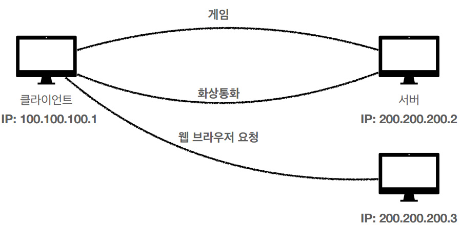
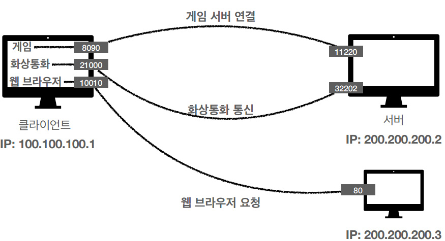
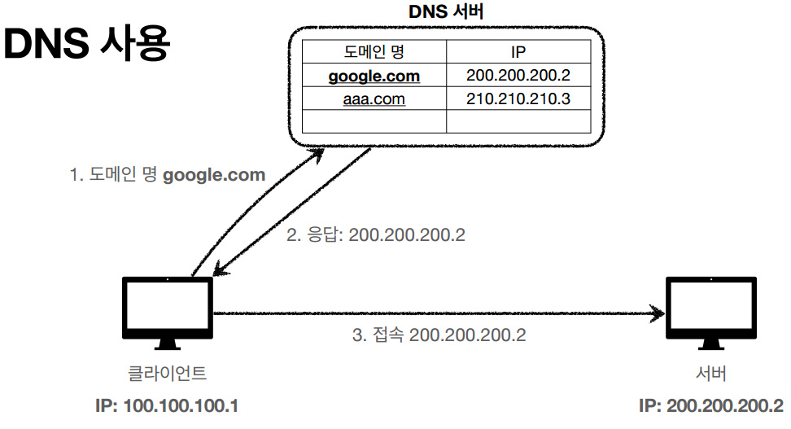
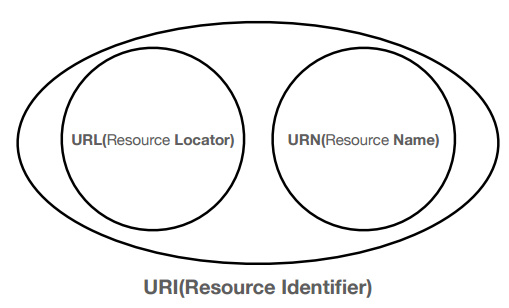
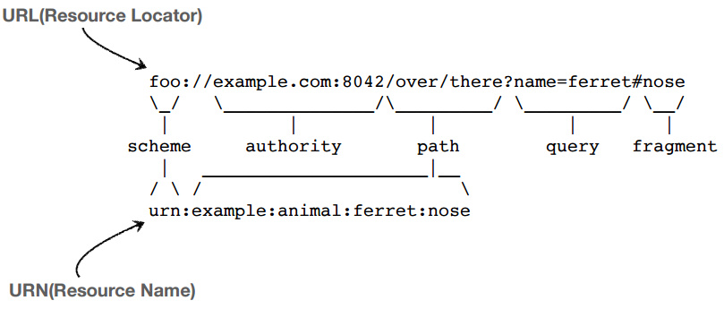

# HTTP

## 1. Internet-network

### 1-1. 인터넷 통신

* 클라이언트와 서버와의 통신은 복잡한 인터넷 망이 필요하다.
* 단순한 요청도 다양한 노드를 거쳐서 서버로 전송된다.

### 1-2. IP(Internet Protocol)

#### IP 인터넷 프로토콜 역할

* 지정된 IP 주소(IP Address)에 데이터 전달
* 패킷(Packet)이라는 통신 단위로 데이터 전달

#### IP 패킷 정보

* 출발지 IP
* 목적지 IP
* 기타...
* 전송 데이터

#### 클라이언트 패킷 전달

* 출발 IP Address를 가진 패킷이 목적 IP Address 까지 전송이 된다.
* 중간에는 노드간에 패킷을 전달하여 최종 목적지까지 도달한다.

#### 서버 패킷 전달

* 서버에서도 패킷을 전달할때 출발 IP Address 정보를 토대로 노드간에 패킷을 전달하여 클라이언트까지 도달한다.

#### IP 프로토콜의 한계

* 비연결성
    * 패킷을 받을 대상이 없거나 서비스 불능 상태여도 패킷 전송
* 비신뢰성
    * 중간에 패킷이 사라지면? - 패킷 소실
    * 패킷이 순서대로 안오면? - 패킷 전달 순서 문제 발생
* 프로그램 구분
    * 같은 IP를 사용하는 서버에서 통신하는 애플리케이션이 둘 이상이면?

### 1-3. TCP, UDP

#### 인터넷 프로토콜 스택의 4계층

#### 프로토콜 계층

#### IP 패킷 정보

* 패킷 : package + bucket
* 통신망을 통해 전송하기 쉽도록 자른 데이터의 전송 단위

#### TCP/IP 패킷 정보

* 기존의 IP 패킷에 추가로 출발지 port, 목적지 port, 전송제어 순서 검증 정보 추가
* IP 만으로는 해결하지 못했던 문제를 해결

#### TCP 특징

전송 제어 프로토콜(Transmission Control Protocol)

* 연결 지향 - TCP 3 wqy handshake (가상 연결)
* 데이터 전달 보증
* 순서 보장
* 신뢰할 수 있는 프로토콜
* 현재는 대부분 TCP 사용

#### TCP 3 way handshake

1. 클라이언트가 서버로 SYN(연결 요청)을 보낸다.
2. 서버가 클라이언트에게 연결요청을 받았다는 의미로 ACK 를 보냄과 동시에 SYN 을 보낸다.
3. 클라이언트가 서버에게 SYN에 대한 ACK 를 전송한다.
4. 데이터를 전송한다. (3번 단계에서 ACK와 함께 데이터 전송 가능)

* SYN(연결 요청)을 보내면 연결 요청에 승인한다는 ACK를 보내는 작업을 클라이언트와 서버가 모두 수행해야 클라이언트와 서버가 논리적으로 연결이 되었다고 말할 수 있다.

#### 데이터 전달 보증

* 클라이언트가 서버로 데이터를 전송하면 서버는 클라이언트에게 데이터를 잘 받았다고 알려준다.

#### 순서 보장

* 더 최적화된 방법도 존재한다.
* 우선 개념적으로 순서를 보장할 수 있다는 것만 알고 넘어가자.

#### UDP 특징

사용자 데이터그램 프로토콜(User Datagram Protocol)

* 하얀 도화지에 비유(기능이 거의 없음)
* 연결 지향 - TCP 3 way handshake X
* 데이터 전달 보증 X
* 순서 보장 X
* 데이터 전달 및 순서가 보장되지 않지만, 단순하고 빠름
* 정리
    * IP와 거의 같다. + PORT + 체크섬 정도만 추가
    * 애플리케이션에서 추가 작업 필요

### 1-4. PORT

#### 한번에 둘 이상 연결해야 하면?

* 하나의 클라이언트가 여러 서버와 통신할때, 각 서버에서 날아오는 패킷들이 어떤 애플리케이션에 요청한 패킷인가?

#### TCP/IP 패킷 정보

* 출발지 PORT, 목적지 PORT

#### PORT - 같은 IP 내에서 프로세스 구분

* IP : 아파트
* PORT : 몇동 몇호?

#### PORT

* 0 ~ 65535 : 할당 가능
* 0 ~ 1023 : 잘 알려진 포트, 사용하지 않는 것이 좋음
    * FTP - 20, 21
    * TELNET - 23
    * HTTP - 80
    * HTTPS - 443

### 1-5. DNS

#### IP 주소의 단점

* IP 주소는 사람이 기억하기 어렵다.
* IP 주소는 변경될 수 있다. -> 새로운 IP 주소를 알지 못하면 전송 불가능

#### DNS

**도메인 네임 시스템(Domain Name System)**

* 전화번호부
* 도메인 명을 IP 주소로 변환

## 2. URI와 웹 브라우저 요청 흐름

* URL
* 웹 브라우저 요청 흐름

### 2-1. URI (Uniform Resource Identifier)

* URI? URL? URN?
* URI는 로케이터(locator), 이름(name) 또는 둘다 추가로 분류될 수 있다.

#### URI 단어 뜻

* **U**niform : 리소스 식별하는 통일된 방식
* **R**esource : 자원, URI로 식별할 수 있는 모든 것(제한 없음)
* **I**dentifier : 다른 항목과 구분하는데 필요한 정보

* URL : Uniform Resource Locator
* URN : Uniform Resource Name

#### URL, URN 단어 뜻

* URL - Locator : 리소스가 있는 위치를 지정
* URN - Name : 리소스에 이름을 부여
* 위치는 변할 수 있지만, 이름은 변하지 않는다.
* urn:isbn:8960777331 (어떤 책의 isbn URN)
* URN 이름만으로 실제 리소스를 찾을 수 있는 방법이 보편화 되지 않음
* **앞으로 URI를 URL과 같은 의미로 이야기하겠음**

#### URL 분석

<https://www.google.com/search?q=hello&hl=ko>

#### URL 전체 문법

* scheme://[userinfo@]host[:port][/path][?query][#fragment]
* https://www.google.com:443/search?q=hello&hl=ko
    

* 프로토콜(https)
* 호스트명(www.google.com)
* 포트 번호(443)
* 패스(/search)
* 쿼리 파라미터(q=hello&hl=ko)

#### URL scheme

* **scheme:**//[userinfo@]host[:port][/path][?query][#fragment]
* **https:**//www.google.com:443/search?q=hello&hl=ko
    
* 주로 프로토콜 사용
* 프로토콜 : 어떤 방식으로 자원에 접근할 것인가 하는 약속, 규칙
    * 예) http, https, ftp 등등
* http는 80 포트, https는 443 포트를 주로 사용, 포트는 생략 가능
* https는 http에 보안 추가 (HTTP Secure)

#### URL userinfo

* scheme://**[userinfo@]**host[:port][/path][?query][#fragment]
* https://www.google.com:443/search?q=hello&hl=ko   

* URL에 사용자 정보를 포함해서 인증
* 거의 사용하지 않음

#### URL host

* scheme://[userinfo@]**host**[:port][/path][?query][#fragment]
* https://**www.google.com**:443/search?q=hello&hl=ko   
* 호스트명
* 도메인명 또는 IP 주소를 직접 사용가능

#### URL PORT

* scheme://[userinfo@]host **[:port]**[/path][?query][#fragment]
* https://www.google.com:**443**/search?q=hello&hl=ko  
* 포트(PORT)
* 접속 포트
* 일반적으로 생략, 생략시 http는 80, https는 443

#### URL path

* scheme://[userinfo@]host[:port] **[/path]**[?query][#fragment]
* https://www.google.com:443 **/search**?q=hello&hl=ko  
* 리소스 경로(path), 계층적 구조
* 예)
    * /home/file1.jpg
    * /members
    * /members/100,/items/iphone12

#### URL query

* scheme://[userinfo@]host[:port] **[/path]**[?query][#fragment]
* https://www.google.com:443/search **?q=hello&hl=ko**  
* key = value 형태
* ?로 시작, &로 추가 가능 ?keyA=valueA&keyB=valueB
* query parameter, query string 등으로 불림, 웹서버에 제공하느 파라미터, 문자형태

#### URL fragment

* scheme://[userinfo@]host[:port][/path][?query] **[#fragment]**
* http://docs.spring.io/spring-boot/docs/current/reference/html/getting-started.html/
  **#getting-started-introducing-spring-boot**   
* fragment
* html 내부 북마크 등에 사용
* 서버에 전송하는 정보 아님

### 2-2. 웹 브라우저 요청 흐름

----

# Note

----

