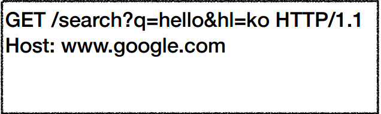
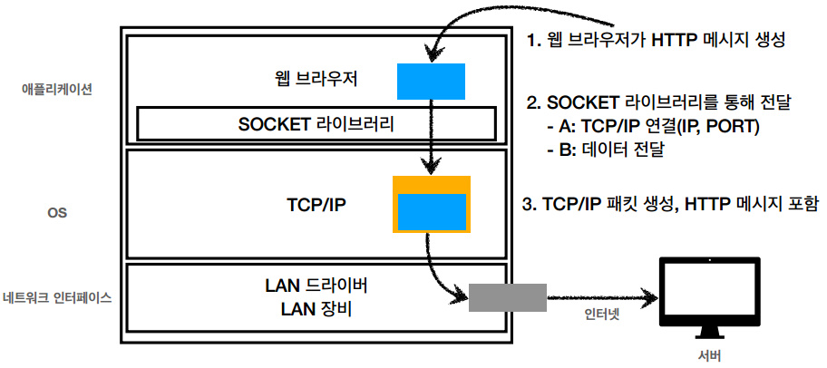
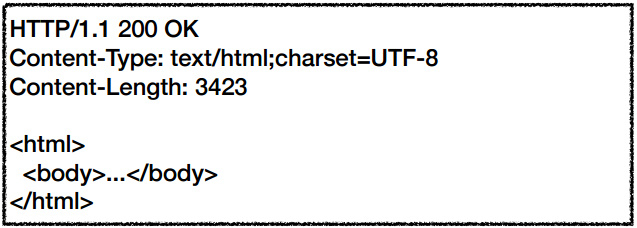

# HTTP 이론 정리

---

## 1. Internet-network

### 1-1. 인터넷 통신

* 클라이언트와 서버와의 통신은 복잡한 인터넷 망이 필요하다.
* 단순한 요청도 다양한 노드를 거쳐서 서버로 전송된다.

### 1-2. IP(Internet Protocol)

#### IP 인터넷 프로토콜 역할

* 지정된 IP 주소(IP Address)에 데이터 전달
* 패킷(Packet)이라는 통신 단위로 데이터 전달

#### IP 패킷 정보

* 출발지 IP
* 목적지 IP
* 기타...
* 전송 데이터

#### 클라이언트 패킷 전달

* 출발 IP Address를 가진 패킷이 목적 IP Address 까지 전송이 된다.
* 중간에는 노드간에 패킷을 전달하여 최종 목적지까지 도달한다.

#### 서버 패킷 전달

* 서버에서도 패킷을 전달할때 출발 IP Address 정보를 토대로 노드간에 패킷을 전달하여 클라이언트까지 도달한다.

#### IP 프로토콜의 한계

* 비연결성
    * 패킷을 받을 대상이 없거나 서비스 불능 상태여도 패킷 전송
* 비신뢰성
    * 중간에 패킷이 사라지면? - 패킷 소실
    * 패킷이 순서대로 안오면? - 패킷 전달 순서 문제 발생
* 프로그램 구분
    * 같은 IP를 사용하는 서버에서 통신하는 애플리케이션이 둘 이상이면?

### 1-3. TCP, UDP

#### 인터넷 프로토콜 스택의 4계층

#### 프로토콜 계층

#### IP 패킷 정보

* 패킷 : package + bucket
* 통신망을 통해 전송하기 쉽도록 자른 데이터의 전송 단위

#### TCP/IP 패킷 정보

* 기존의 IP 패킷에 추가로 출발지 port, 목적지 port, 전송제어 순서 검증 정보 추가
* IP 만으로는 해결하지 못했던 문제를 해결

#### TCP 특징

전송 제어 프로토콜(Transmission Control Protocol)

* 연결 지향 - TCP 3 wqy handshake (가상 연결)
* 데이터 전달 보증
* 순서 보장
* 신뢰할 수 있는 프로토콜
* 현재는 대부분 TCP 사용

#### TCP 3 way handshake

1. 클라이언트가 서버로 SYN(연결 요청)을 보낸다.
2. 서버가 클라이언트에게 연결요청을 받았다는 의미로 ACK 를 보냄과 동시에 SYN 을 보낸다.
3. 클라이언트가 서버에게 SYN에 대한 ACK 를 전송한다.
4. 데이터를 전송한다. (3번 단계에서 ACK와 함께 데이터 전송 가능)

* SYN(연결 요청)을 보내면 연결 요청에 승인한다는 ACK를 보내는 작업을 클라이언트와 서버가 모두 수행해야 클라이언트와 서버가 논리적으로 연결이 되었다고 말할 수 있다.

#### 데이터 전달 보증

* 클라이언트가 서버로 데이터를 전송하면 서버는 클라이언트에게 데이터를 잘 받았다고 알려준다.

#### 순서 보장

* 더 최적화된 방법도 존재한다.
* 우선 개념적으로 순서를 보장할 수 있다는 것만 알고 넘어가자.

#### UDP 특징

사용자 데이터그램 프로토콜(User Datagram Protocol)

* 하얀 도화지에 비유(기능이 거의 없음)
* 연결 지향 - TCP 3 way handshake X
* 데이터 전달 보증 X
* 순서 보장 X
* 데이터 전달 및 순서가 보장되지 않지만, 단순하고 빠름
* 정리
    * IP와 거의 같다. + PORT + 체크섬 정도만 추가
    * 애플리케이션에서 추가 작업 필요

### 1-4. PORT

#### 한번에 둘 이상 연결해야 하면?

* 하나의 클라이언트가 여러 서버와 통신할때, 각 서버에서 날아오는 패킷들이 어떤 애플리케이션에 요청한 패킷인가?

#### TCP/IP 패킷 정보

* 출발지 PORT, 목적지 PORT

#### PORT - 같은 IP 내에서 프로세스 구분

* IP : 아파트
* PORT : 몇동 몇호?

#### PORT

* 0 ~ 65535 : 할당 가능
* 0 ~ 1023 : 잘 알려진 포트, 사용하지 않는 것이 좋음
    * FTP - 20, 21
    * TELNET - 23
    * HTTP - 80
    * HTTPS - 443

### 1-5. DNS

#### IP 주소의 단점

* IP 주소는 사람이 기억하기 어렵다.
* IP 주소는 변경될 수 있다. -> 새로운 IP 주소를 알지 못하면 전송 불가능

#### DNS

**도메인 네임 시스템(Domain Name System)**

* 전화번호부
* 도메인 명을 IP 주소로 변환

## 2. URI와 웹 브라우저 요청 흐름

* URL
* 웹 브라우저 요청 흐름

### 2-1. URI (Uniform Resource Identifier)

* URI? URL? URN?
* URI는 로케이터(locator), 이름(name) 또는 둘다 추가로 분류될 수 있다.

#### URI 단어 뜻

* **U**niform : 리소스 식별하는 통일된 방식
* **R**esource : 자원, URI로 식별할 수 있는 모든 것(제한 없음)
* **I**dentifier : 다른 항목과 구분하는데 필요한 정보

* URL : Uniform Resource Locator
* URN : Uniform Resource Name

#### URL, URN 단어 뜻

* URL - Locator : 리소스가 있는 위치를 지정
* URN - Name : 리소스에 이름을 부여
* 위치는 변할 수 있지만, 이름은 변하지 않는다.
* urn:isbn:8960777331 (어떤 책의 isbn URN)
* URN 이름만으로 실제 리소스를 찾을 수 있는 방법이 보편화 되지 않음
* **앞으로 URI를 URL과 같은 의미로 이야기하겠음**

#### URL 분석

<https://www.google.com/search?q=hello&hl=ko>

#### URL 전체 문법

* scheme://[userinfo@]host[:port][/path][?query][#fragment]
* https://www.google.com:443/search?q=hello&hl=ko
    

* 프로토콜(https)
* 호스트명(www.google.com)
* 포트 번호(443)
* 패스(/search)
* 쿼리 파라미터(q=hello&hl=ko)

#### URL scheme

* **scheme:**//[userinfo@]host[:port][/path][?query][#fragment]
* **https:**//www.google.com:443/search?q=hello&hl=ko
    
* 주로 프로토콜 사용
* 프로토콜 : 어떤 방식으로 자원에 접근할 것인가 하는 약속, 규칙
    * 예) http, https, ftp 등등
* http는 80 포트, https는 443 포트를 주로 사용, 포트는 생략 가능
* https는 http에 보안 추가 (HTTP Secure)

#### URL userinfo

* scheme://**[userinfo@]**host[:port][/path][?query][#fragment]
* https://www.google.com:443/search?q=hello&hl=ko   

* URL에 사용자 정보를 포함해서 인증
* 거의 사용하지 않음

#### URL host

* scheme://[userinfo@]**host**[:port][/path][?query][#fragment]
* https:// **www.google.com**:443/search?q=hello&hl=ko   
* 호스트명
* 도메인명 또는 IP 주소를 직접 사용가능

#### URL PORT

* scheme://[userinfo@]host **[:port]**[/path][?query][#fragment]
* https://www.google.com: **443**/search?q=hello&hl=ko  
* 포트(PORT)
* 접속 포트
* 일반적으로 생략, 생략시 http는 80, https는 443

#### URL path

* scheme://[userinfo@]host[:port] **[/path]**[?query][#fragment]
* https://www.google.com:443 **/search**?q=hello&hl=ko  
* 리소스 경로(path), 계층적 구조
* 예)
    * /home/file1.jpg
    * /members
    * /members/100,/items/iphone12

#### URL query

* scheme://[userinfo@]host[:port] **[/path]**[?query][#fragment]
* https://www.google.com:443/search **?q=hello&hl=ko**  
* key = value 형태
* ?로 시작, &로 추가 가능 ?keyA=valueA&keyB=valueB
* query parameter, query string 등으로 불림, 웹서버에 제공하느 파라미터, 문자형태

#### URL fragment

* scheme://[userinfo@]host[:port][/path][?query] **[#fragment]**
* http://docs.spring.io/spring-boot/docs/current/reference/html/getting-started.html/
  **#getting-started-introducing-spring-boot**   
* fragment
* html 내부 북마크 등에 사용
* 서버에 전송하는 정보 아님

### 2-2. 웹 브라우저 요청 흐름

####                                                                                                                                                                                                                                                                                                                                                                                                                                                                                                                                                                                                                          

* https://www.google.com/search?q=hello&hl=ko
* https://**www.google.com:443**/search?q=hello&hl=ko
    * DNS 조회
    * HTTPS PORT 생략, 443
    * HTTP 요청 메시지 생성

#### HTTP 요청 메시지

  

#### HTTP 메시지 전송

  

* TCP/IP 계층에서 생성된 패킷은 HTTP 메시지, 출발지 IP, PORT, 목적지 IP, PORT 를 포함하고 있다.
* 패킷이 웹 브라우저 (클라이언트) 에서 서버로 전송된다.
* 서버는 HTTP 응답 메시지를 웹 브라우저에게 전송한다.

  

* HTTP 응답메시지  
  

* 웹 브라우저는 응답 패킷을 받아서 HTML를 랜더링하여 사용자에게 페이지를 보여준다.

## 3. HTTP 기본

* 모든것이 HTTP
* 클라이언트 서버 구조
* Stateful, Stateless
* 비 연결성(connectionless)
* HTTP 메시지  
* **HTTP** (**H**yper**T**ext **T**ransfer **P**rotocol)

### 3-1. 모든것이 HTTP

HTTP 메시지에 모든 것을 전송  

* HTML, TEXT
* IMAGE, 음성, 영상, 파일
* JSON, XML (API)
* 거의 모든 형태의 데이터 전송 가능
* 서버간에 데이터를 주고 받을 때도 대부분 HTTP 사용
* **지금은 HTTP 시대**!

#### HTTP 역사

* HTTP/0.9 1991년: GET 메서드만 지원, HTTP 헤더 X
* HTTP/1.0 1996년: 메서드, 헤더 추가
* **HTTP/1.1 1997년: 가장 많이 사용, 우리에게 가장 중요한 버전**
    * RFC2068(1997) -> RFC2626(1999) -> RFC7230~7235(2014)
* HTTP/2 2015년: 성능 개선
* HTTP/2 진행중: TCP 대신에 UDP 사용, 성능 개선

#### 기반 프로토콜

* TCP : HTTP/1.1, HTTP/2
* UDP : HTTP/3
* 현재 HTTP/1.1 주로 사용
    * HTTP/2, HTTP/3 도 점점 증가

#### HTTP 특징

* 클라이언트 서버 구조
* 무상태 프로토콜(스테이스리스), 비연결성
* HTTP 메시지
* 단순함, 확장 기능  
* 위의 내용은 이후 더 자세히 설명...

### 3-2. 클라이언트 서버 구조

* Request Response 구조
* 클라이언트는 서버에 요청을 보내고, 응답을 대기
* 서버가 요청에 대한 결과를 만들어서 응답  
* 클라이언트와 서버가 분리되어 있다는 개념이 중요함 (이전에는 분리되어 있지 않고 통합되어 있던 시절이 있었음)
* 서버 -> 비즈니스 로직, 데이터등, 클라이언트 -> UI, 사용성
* 클라이언트와 서버가 각각 독립적으로 진화가 가능!!!

### 3-3. Stateful, Stateless

#### 무상태 프로토콜

스테이스리스(StateLess)

* 서버가 클라이언트의 상태를 보존X
* 장점: 서버 확장성 높음(스케일 아웃)
* 단점: 클라이언트가 추가 데이터 전송

#### Stateful, Stateless 차이

**< 상태 유지 - Stateful >**

* 고객: 이 **노트북** 얼마인가요?
* 점원: 100만원 입니다.  
* 고객: **2개** 구매하겠습니다.
* 점원: 200만원 입니다. **신용카드, 현금중**에 어떤 걸로 구매하시겠어요?  
* 고객: 신용카드로 구매하겠습니다.
* 점원: 200만원 결제 완료되었습니다.

**< 상태유지 - Stateful, 점원이 중간에 바뀌면? >**

* 고객: 이 **노트북** 얼마인가요?
* 점원**A**: 100만원 입니다.  
* 고객: **2개** 구매하겠습니다.
* 점원**B**: ? 무엇을 2개 구매하시겠어요?  
* 고객: 신용카드로 구매하겠습니다.
* 점원**C**: ? 무슨 제품을 몇개 신용카드로 구매하시겠어요?

**< 상태 유지 - Stateful, 정리 >**

* 고객: 이 **노트북** 얼마인가요?
* 점원: 100만원 입니다.**(노트북 상태 유지)**  
* 고객: **2개** 구매하겠습니다.
* 점원: 200만원 입니다. **신용카드, 현금**중에 어떤 걸로 구매하시겠어요?
   **(노트북, 2개 상태 유지)**  
* 고객: 신용카드로 구매하겠습니다.
* 점원: 200만원 결제 완료되었습니다. **(노트북, 2개, 신용카드 상태 유지)**

**< 무상태 - Stateless >**

* 고객: 이 **노트북** 얼마인가요?
* 점원: 100만원 입니다.  
* 고객: **노트북 2개** 구매하겠습니다.
* 점원: 노트북 2개는 200만원 입니다. **신용카드, 현금중**에 어떤 걸로 구매 하시겠어요?  
* 고객: **노트북 2개를 신용카드**로 구매하겠습니다.
* 점원: 200만원 결제 완료되었습니다.

**< 무상태 - Stateless, 점원이 중간에 바뀌면? >**

* 고객: 이 **노트북** 얼마인가요?
* 점원**A**: 100만원 입니다.  
* 고객: **노트북 2개** 구매하겠습니다.
* 점원**B**: 노트북 2개는 200만원 입니다. **신용카드, 현금중**에 어떤 걸로 구매 하시겠어요?  
* 고객: **노트북 2개를 신용카드**로 구매하겠습니다.
* 점원**C**: 200만원 결제 완료되었습니다.

**< 정리 >**

* **상태 유지**: 중간에 다른 점원으로 바뀌면 안된다. 
  (중간에 다른 점원으로 바뀔 때 상태 정보를 다른 점원에게 미리 알려줘야 한다.)
    * 항상 같은 서버가 유지되어야 한다.
    * 중간에 서버가 장애가 나면 모든 클라이언드는 서버와 데이터를 주고받을 수 없다.
* **무상태**: 중간에 다른 점원으로 바뀌어도 된다.
    * 갑자기 고객이 증가해도 점원을 대거 투입할 수 있다.
    * 갑자기 클라이언트 요청이 증가해도 서버를 대거 투입할 수 있다.
    * 아무 서버나 호출해도 된다.
        * 중간에 서버가 장애가 나도 다른 서버와 데이터를 통신하면 된다.(클라이언트 입장에서는 특정 서버가 장애가 나도 불편함을 받지 않는다.)
    * 스케일 아웃 - 수평 확장에 유리하다.
        * 무상태는 응답 서버를 쉽게 바꿀 수 있다. -> **무한한 서버 증설 가능**

#### Stateless  실무 한계

* 모든 것을 무상태로 설계 할 수 있는 경우도 있고 없는 경우도 있다.
* 무상태
    * 예) 로그인이 필요 없는 단순한 서비스 소개 화면
* 상태 유지
    * 예) 로그인
* 로그인한 사용자의 경우 로그인 했다는 상태를 서버에 유지
* 일반적으로 브라우저 쿠키와 서버 세션등을 사용해서 상태 유지
* 상태 유지는 **최소한만 사용!!!**

### 3-4. 비 연결성(connectionless)

#### 연결을 유지하는 모델

* 서버는 여러 클라이언트와 연결을 계속 유지
* 서버 자원 소모

#### 연결을 유지하지 않는 모델

* 서버는 클라이언트와 연결 유지 X
* 최소한의 자원 유지

#### 비 연결성

* HTTP는 기본이 연결을 유지하지 않는 모델
* 일반적으로 초 단위 이하의 빠른 속도로 응답
* 1시간 동안 수천명이 서비스를 사용해도 실제 서버에서 동시에 처리하는 요청은 수십개 이하로 매우 작음
    * 예) 웹 브라우저에서 계속 연속해서 검색 버튼을 누르지는 않는다.
* 서버 자원을 매우 효율적으로 사용 가능

**비 연결성의 한계와 극복**

* TCP/IP 연결을 새로 맺어야 함 - 3 way handshake 시간 추가
* 웹 브라우저로 사이트를 요청하면 HTML 뿐만 아니라 자바스크립드, css, 추가 이미지 등등 수 많은 자원이 함께 다운로드
* 지금은 HTTP 지속 연결(Persistent Connections)로 문제 해결
* HTTP/2, HTTP/3에서 더 많은 최적화

#### 스테이스리스를 기억하자!!! **서버 개발자들이 어려워하는 업무**

* 정말 같은 시간에 딱 맞추어 발생하는 대용량 트래픽
* 예) 선착순 이벤트, 명정 KTX 예약, 학과 수업 등록
* 예) 저녁 6:00 선착순 1000명 치킨 할인 이벤트 -> 수만명 동시 요청

### 3-5. HTTP 메시지

* HTTP 메시지에 모든 것을 전송
* HTML, TEXT
* IMAGE, 음성, 영상, 파일
* JSON, XML
* 거의 모든 형태의 데이터 전송 가능
* 서버간에 데이터를 주고 받을 때도 대부분 HTTP 사용
* **지금은 HTTP 시대!**

#### HTTP 메시지 구조

#### 시작 라인 요청 메시지

* start-line = **request-line** / status - line
* **request-line** = method SP(공백) request-target SP HTTP-version CRLF(엔터)
* HTTP 메서드 (GET: 조회)
* 요청 대상(/search?q=hello&hl=ko)
* HTTP Version

#### 시작 라인 요청 메시지 - HTTP메서드

* 종류 : GET, POST, PUT, DELETE ...
* 서버가 수행해야 할 동작 지정
    * GET : 리소스 조회
    * POST : 요청 내역 처리

#### 시작 라인 요청 메시지 - 요청 대상

* absolute - path\[?query](절대경로\[?쿼리])
* 절대경로 = "/"로 시작하는 경로
* 참고 : *, http://...?x=y 와 같이 다른 유형의 경로 지정 방법도 있다.

#### 시작 라인 - 요청 메시지 - HTTP 버전

* HTTP Version

#### 시작 라인 응답 메시지

* start-line = request-line / **status-line**
* **status-line** = HTTP-version SP status-code SP reason-phrase CRLF
* HTTP 버전
* HTTP 상태 코드 : 요청 성공, 실패를 나타냄
    * 200 : 성공
    * 400 : 클라이언트 요청 오류
    * 500 : 서버 내부 오류
* 이유 문구 : 사람이 이해할 수 있는 짧은 상태 코드 설명 글

#### HTTP 헤더

* header-field = filed-name":"OWS fields-value OWS (OWS: 띄어쓰기 허용)
* field-name은 대소문자 구분 없음

#### HTTP 헤더 용도

* HTTP 전송에 필요한 모든 부가 정보
* 예) 메시지 바디의 내용, 메세지 바디의 크기, 압축, 인증, 요청 클라이언트(브라우저)정보, 서버 애플리케이션 정보, 캐시 관리 정보...)
* 표준 헤더가 너무 많음
* 필요시 임의의 헤더 추가 가능
    * helloworld: hihi

#### HTTP 메시지 바디 용도

* 실제 전송할 데이터
* HTML 문서, 이미지, 영상, JSON 등등 byte로 표현할 수 있는 모든 데이터 전송 가능

#### 단순함 확장 가능

* HTTP는 단순하다.
* HTTP 메시지도 매우 단순
* 크게 성골하는 표준 기술은 단순하지만 확장 가능한 기술

#### HTTP 정리

* HTTP 메시지에 모든 것을 전송
* HTTP 역사 HTTP/1.1을 기준으로 학습
* 클라이언트 서버 구조
* 무상태 프로토콜(스테이스리스)
* HTTP 메시지
* 단순함, 확장 가능
* **지금은 HTTP시대**

## 4. HTTP 메서드

### 4-1 HTTP API를 만들어보자

#### URI 설계에서 가장 중요한 것은 리소스 식별

* 리소스의 의미
    * 회원을 등록하고 수정하고 조회하는 것이 리소스가 아니다!
    * 예) 미네랄을 캐라 -> 미네랄이 리소스
    * **회원이라는 개념 자체가 바로 리소스이다.**

* 리소스를 어떻게 식별하는게 좋을까?
    * 회원을 등록하고 수정하고 조회하는 것을 모두 배제
    * **회원이라는 리소스만 식별하면 된다. -> 회원 리소스를 URI에 매핑**

* API URI 설계
* **회원** 목록 조회/members
* **회원** 조회 /members{id}
* **회원** 등록 /members{id}
* **회원** 수정 /members{id}
* **회원** 삭제 /members{id}
* 참고 : 계층 구조상 상위를 컬렉션으로 보고 복수단어 사용 권장(member -> members)

* 리소스와 행위를 분리
* **URI는 리소스만 식별!!**
* **리소스**와 해당 리소스를 다상으로 하는 **행위**를 분리
    * 리소스 : 회원
    * 행위 : 조회, 등록, 삭제, 변경

* 리소스는 명사, 행위는 동사(미네랄을 캐라)
* 행위(메서드)는 어떻게 구분?

### 4-2. HTTP 메서드 - GET, POST

#### HTTP 메서드 종류

* 주요 메서드
    * GET : 리소스 조회
    * POST : 요청 데이터 처리, 주로 등록에 사용
    * PUT : 리소스를 대체, 해당 리소스가 없으면 생성
    * PATCH : 리소스 부분 변경
    * DELETE : 리소스 삭제

* 기타 메서드
    * HEAD : GET과 동일하지만 메시지 부분을 제외하고, 상태 줄과 헤더만 반환
    * OPTIONS : 대상 리소스에 대한 통신 가능 옵션(메서드)을 설명(주로 CORS에서 사용)
    * Connect : 대상 자원으로 식별되는 서버에 대한 터널을 설정
    * TRACE : 대상 리소스에 대한 경로를 다라 메시지 루프백 테스트를 수행

#### GET

* 리소스 조회
* 서버에 전달하고 싶은 데이터는 query(쿼리 파라미터, 쿼리 스트링)를 통해서 전달
* 메시지 바디를 사용해서 데이터를 전달할 수 있지만, 지원하지 않는 곳이 많아서 권장하지 않음

#### POST

* 요청 데이터 처리
* **메시지 바디를 통해 서버로 요청 데이터 전달**
* 서버는 요청 데이터를 처지
    * 메시지 바디를 통해 들어온 데이터를 처리하는 모든 기능을 수행한다.

* 주로 전달된 데이터로 신규 리소스 등록, 프로세스 처리에 사용

* 요청 데이터를 어떻게 처리한다는 뜻일까? 예시
    * 스펙 : POST 메서드는 **대상 리소스가 리소스의 고유 한 의미 체계에 따라 요청에 포함 된 표현을 처리하도록 요청**한다. (구글 번역...)
    * 예를 들어 POST는 다음과 같은 기능에 사용된다.
        * HTML 양식에 입력된 필드와 같은 데이터 블록을 데이터 처리 프로세스에 제공
            * 예) HTML FORM 에 입력한 정보로 회원 가입, 주문 등에서 사용
        * 게시판, 뉴스 그룹, 메일링 리스트, 블로그 또는 유사한 기사 그룹에 메시지 게시
            * 예) 게시판 글쓰기, 댓글 달기
        * 서버가 아직 식별하지 않은 새 리소스 생성
            * 예) 신규 주문 생성
        * 기존 자원에 데이터 추가
    * **정리 : 이 리소스 URI에 POST 요청이 오면 요청 데이터를 어떻게 처리할지 리소스마다 따로 정해야 함 -> 정해진 것이 없음**

#### POST 정리

1. 새 리소스 생성(등록)
    * 서버가 아직 식별하지 않은 새 리소스 생성

2. 요청 데이터 처리
    * 단순히 데이터를 생성하거나, 변경하는 것을 넘어서 프로세스를 처리해야 하는 경우
    * 예) 주문에서 결제완료 -> 배달 시작 -> 배달 완료 처럼 단순히 값 변경을 넘어 프로세스의 상태가 변경되는 경우
    * POST 의 결과로 새로운 리소스가 생성되지 않을 수도 있음
    * 예) POST/orders/{orderId}/start-delivery (컨트롤 URI)

3. 다른 메서드로 처리하기 애매한 경우
    * 예) JSON으로 조회 데이터를 넘겨야 하는데, GET 메서드를 사용하기 어려운 경우
    * 애매하면 POST

### 4-3. HTTP 메서드 - PUT, PATCH, DELETE

#### PUT

* **리소스를 대체**
    * 리소스가 있으면 대체
    * 리소스가 없으면 생성
    * 쉽게 이야기 해서 덮어버림

* **중요! 클라이언트가 리소스를 식별**
    * 클라이언트가 리소스 위치를 알고 URI 지정
    * POST와 차이점

#### PATCH

* 리소스 부분 변경
* PUT에서 리소스를 부분 변경하려다가 완전히 변경되는 사고 발생

#### DELETE

* 리소스 제거

### 4-4. HTTP 메서드의 속성

* 안전(Sate Methods)
* 멱등(Idempotent Method)
* 캐시가능(Cacheable Method)

#### 안전

* 호출해도 리소스를 변경하지 않는다.
* Q: 그래도 계속 호출해서, 로그 같은게 쌓여서 장애가 발생하면요?
* A: 안전은 해당 리소스만 고려한다. 그런 부분까지 고려하지 않는다.

#### 멱등

* 한 번 호출하든 두 번 호출하든 100번 호출하든 결과가 똑같다.
* 멱등 메서드
    * GET : 한 번 조회하든, 두 번 조회하든 같은 결과가 조회된다.
    * PUT : 결과를 대체한다. 따라서 같은 요청을 여러번 해도 최종 결과는 같다.
    * DELETE : 결과를 삭제한다. 같은 요청을 여러번 해도 삭제된 결과는 똑같다.
    * **POST : 멱등이 아니다!!! 두 번 호출하면 같은 결제가 중복해서 발생할 수 있다.**

* 활용
    * 자동 복구 메커니즘
    * 서버가 TIMEOUT 등으로 정상 응답을 못주었을 때, 클라이언트가 같은 요청을 다시 해도 되는가? 판단 근거

* Q : 재요청 중간에 다른 곳에서 리소스를 변경해버리면?
* A : 멱등은 외부 요인으로 중간에 리소스가 변경되는 것 까지는 고려하지는 않는다.

#### 캐시가능

* 응답 결과 리소스를 캐시해서 사용해도 되는가?
* GET, HEAD, POST, PATCH 캐시 가능
* 실제로는 GET, HEAD 정도만 캐시로 사용
    * POST, PATCH는 본문 내용까지 캐시 키로 고려해야 하는데, 구현이 쉽지 않음

## 5. HTTP 메서드 활용

***

* 클라이언트에서 서버로 데이터 전송
* HTTP API 설계 예시

### 5-1. 클라이언트에서 서버로 데이터 전송

#### 클라이언트에서 서버로 데이터 전송 - 데이터 전달 방식은 크게 2가지

* **쿼리 파라미터를 통한 데이터 전송**
    * GET
    * 주로 정렬 필터(검색어)

* **메시지 바디를 통한 데이터 전송**
    * POST, PUT, PATCH
    * 회원 가입, 상품 주문, 리소스 등록, 리소스 변경

#### 클라이언트에서 서버로 데이터 전송 - 4가지 상황

* **정적 데이터 조회**
    * 이미지, 정적 텍스트 문서

* **동적 데이터 조회**
    * 주로 검색, 게시판 목록에서 정렬 필터(검색어)

* **HTML Form을 통한 데이터 전송**
    * 회원 가입, 상품 주문, 데이터 변경

* **HTTP API를 통한 데이터 전송**
    * 회원 가입, 상품 주문, 데이터 변경
    * 서버 to 서버, 앱 클라이언트, 웹 클라이언트 (Ajax)

#### 정적 데이터 조회 -쿼리 파라미터 미사용

#### 정적 데이터 조회  -정리

* 이미지, 정적 텍스트 문서
* 조회는 GET 사용
* 정적 데이터는 일반적으로 쿼리 파라미터 없이 리소스 경로로 단순하게 조회 가능

#### 동적 데이터 조회  -쿼리 파라미터 사용

#### 동적 데이터 조회  -정리

* 주로 검색, 게시판 목록에서 정렬 필터(검색어)
* 조회 조건을 줄여주는 필터, 조회 결과를 정렬하는 정렬 조건에 주로 사용
* 조회는 GET 사용
* GET는 쿼리 파라니터 사용해서 데이터를 전달

#### HTML Form 데이터 전송  POST전송 - 저장

#### HTML Form 데이터 전송  GET전송 - 저장

#### HTML Form 데이터 전송  GET전송 - 조회

#### HTML Form 데이터 전송  multipart/form-data

#### HTML Form 데이터 전송  정리

* HTML Form submit시 POST 전송
    * 예) 회원 가입, 상품 주문, 데이터 변경

* Content-Type : application/x-www-form-urlencoded 사용
    * form의 내용을 메시지 바디를 통해서 전송(key=value, 쿼리 파라미터 형식)
    * 전송 데이터를 url encoding 처리
        * 예) abc김 -> abc%EA%B9%8
* HTML Form은 GET 전송도 가능
* Content-Tpye: multipart/form-data
    * 파일 업로드 같은 바이너리 데이터 전송시 사용
    * 다른 종류의 여러 파일과 폼의 내용 함께 전송 가능(그래서 이름이 multipart)
* 참고: HTML Form 전송은 **GET, POST만 지원**

#### HTTP API 데이터 전송

#### HTTP API 데이터 전송  정리

* 서버 to 서버
    * 백엔드 시스템 통신
* 앱 클라이언트
    * 아이폰, 안드로이드
* 웹 클라이언트
    * HTML에서 Form 전송 대신 자바 스크립트를 통한 통신에 사용(AJAX)
    * 예) React, VueJs 같은 웹 클라이언트와 API 통신
* POST, PUT, PATCH: 메시지 바디를 통해 데이터 전송
* GET: 조회, 쿼리 파라미터로 데이터 전달
* Content-Type: application/json을 주로 사용(사실상 표준)
    * TEXT, XML, JSON 등등

### 5-2. HTTP API 설계 예시

* **HTTP API - 컬렉션**
    * **POST 기반 등록**
    * 예) 회원 관리 API 제공
* **HTTP API - 스토어**
    * **PUT 기반 등록**
    * 예) 정적 컨텐츠 관리, 원격 파일 관리

* **HTML FORM 사용**
    * 웹 페이지 회원 관리
    * GET, POST만 지원

#### 회원 관리 시스템  API 설계 - POST 기반 등록

* **회원** 목록 /members **-> GET**
* **회원** 등록 /members **-> POST**
* **회원** 조회 /members{id} **-> GET**
* **회원** 수정 /members{id} **-> PATCH, PUT, POST**
* **회원** 삭제 /members{id} **-> DELETE**

#### 회원 관리 시스템  POST - 신규 자원 등록 특징

* 클라이언트는 등록될 리소스의 URI를 모른다.
    * 회원 등록 /members -> POST
    * POST /members

* 서버가 새로 등록된 리소스 URI를 생성해준다.
    * HTTP/1.1 201 Created 
      Location: **members/100**

* 컬렉션(Collections)
    * 서버가 관리하는 리소스 디렉토리
    * 서버가 리소스의 URI를 생성하고 관리
    * 여기서 컬렉션은 /members

#### 파일 관리 시스템  API 설계 - PUT 기반 등록

* **파일** 목록 /files **-> GET**
* **파일** 조회 /files/{filename} **-> GET**
* **파일** 등록 /files/{filename} **-> PUT**
* **파일** 삭제 /files/{filename} **-> DELETE**
* **파일** 대량 등록 /files **-> POST**

#### 파일 관리 시스템  PUT - 신규 자원 등록 특징

* 클라이언트가 리소스 URI를 알고 있어야 한다.
    * 파일 등록 /files/{filename} -> PUT
    * PUT **/files/star.jpg**

* 클라이언트가 직접 리소스의 URI를 지정한다.
    * PUT 은 해당 리소스를 먼저 찾는 과정을 수행한다. 해당 리소스를 찾으려면 URI가 필요하다.

* 스토어(Store)
    * 클라이언트가 관리하는 리소스 저장소
    * 클라이언트가 리소스의 URI를 알고 관리
    * 여기서 스토어는 /files

#### HTML FORM 사용

* HTML FORM은 **GET, POST만 지원**
* AJAX 같은 기술을 사용해서 해결 가능 -> 회원 API 참고
* 여기서는 순수 HTML, HTML FORM 이야기
* GET, POST만 지원하므로 제약이 있음

#### HTML FORM 사용  API 설계

* **회원** 목록 /members **-> GET**
* **회원** 등록 폼 /members/new **-> GET**
* **회원** 등록 /members/new, /members **-> POST**
    * 대부분은 등록 폼과 동일하게 /members/new 방식으로 하는것이 편하다.

* **회원** 조회 /members/{id} **-> GET**
* **회원** 수정 폼 /members/{id}/edit **-> GET**
* **회원** 수정 /members/{id}/edit, /members/{id} **-> POST**
* **회원** 삭제 /members/{id}/delete **->POST**

#### HTML FORM 사용  정리

* HTML FORM은 **GET, POST만 지원**
* **컨트롤 URI**
    * GET, POST만 지원하므로 제약이 있음
    * 이런 제약을 해결하기 위해 동사로 된 리소스 경로 사용
    * POST의 /new, /edit, /delete가 컨트롤 URI
    * HTTP 메서드로 해결하기 애매한 경우 사용(HTTP API 포함)

#### 정리

* **HTTP API - 컬렉션**
    * **POST 기반 등록**
    * **서버가 리소스 URI 결정**
    * 실무에서는 put 기반보다 post 기반을 더 많이 쓴다.

* **HTTP API - 스토어**
    * **PUT 기반 등록**
    * **클라이언트가 리소스 URI 결정**

* **HTML FORM 사용**
    * 순수 HTML + HTML form 사용
    * GET, POST만 지원

#### 정리  참고하면 좋은 URI 설계 개념

* 문서(document)
    * 단일 개념(파일 하나, 객체 인스턴스, 데이터 베이스 row)
    * 예) /members/100, /files/star.jpg

* 컬렉션(collection)
    * 서버가 관리하는 리소스 디렉터리
    * 서버가 리소스의 URI를 생성하고 관리
    * 예) /members

* 스토어(store)
    * 클라이언트가 관리하는 자원 저장소
    * 클라이언트가 리소스의 URI를 알고 관리
    * 예) /files

* 컨트롤러(controller), 컨트롤 URI
    * 문서, 컬렉션, 스토어롤 해결하기 어려운 추가 프로세스 실행
    * 동사를 직접 사용
    * 예) /members/{id}/delete

[참고](http://restfulapi.net/resource-naming)

## 6. HTTP 상태 코드

### 6-1. HTTP 상태 코드 소개

#### 상태 코드

* 클라이언트가 보낸 요청의 처리 상태를 응답에서 알려주는 기능
* 1xx(Informational): 요청이 수신되어 처리중
* 2xx(Successful): 요청 정상 처리
* 3xx(Redirection): 요청을 완료하려면 추가 행동이 필요
* 4xx(Client Error): 클라이언트 요류, 잘못된 문법등으로 서버가 요청을 수행할 수 없음
* 5xx(Server Error): 서버 오류, 서버가 정상 요청을 처리하지 못함

#### 만약 모르는 상태 코드가 나타나면?

* 클라이언트가 인식할 수 없는 상태 코드를 서버가 반환하면?
* 클라이언트는 상위 상태코드로 해석해서 처리
* 미래에 새로운 상태 코드가 추가되어도 클라이언트를 변경하지 않아도 됨
* 예)
    * 299??? -> 2xx(Successful)
    * 451??? -> 4xx(Client Error)
    * 599??? -> 5xx(Server Error)

#### 1xx(Informational)

* 요청이 수신되어 처리중
* 거의 사용하지 않으므로 생략

### 6-2. 2xx - 성공

#### 2xx(Successful)  클라이언트의 요청을 성공적으로 처리

* 200 OK
* 201 Created
* 202 Accepted
* 204 NoContent

#### 200 OK

* 요청 성공

#### 201 Created

* 요청 성공해서 새로운 리소스가 생성됨

#### 202 Accepted

* 요청이 접수되었으나 처리가 완료되지 않았음
* 배치 처리 같은 곳에서 사용
* 예) 요청 접수 후 1시간 뒤에 배치 프로스세가 요청을 처리함

#### 204 No Content

* 서버가 요청을 성공적으로 수행했지만, 응답 페이로드 본문에 보낼 데이터가 없음
* 예) 웹 문서 편집기에서 save 버튼
* save 버튼의 결과로 아무 내용이 없어도 된다.
* save 버튼을 눌러도 같은 화면을 유지해야 한다.
* 결과 내용이 없어도 204 메시지(2xx)만으로 성공을 인식할 수 있다.

### 6-3. 3xx - 리다이렉션

#### 3xx (Redirection)

* 요청을 완료하기 위해 유저 에이전트의 추가 조치 필요
* 300 Multiple Choices
* 301 Moved Permanently
* 302 Found
* 303 See Other
* 304 Not Modified
* 307 Temporary Redirect
* 308 Permanent Redirect

#### 리다이렉션 이해

* 웹 브라우저는 3xx 응답의 결과에 Location 헤더가 있으면, Location 위치로 자동 이동(라다이렉트)

#### 리다이렉션 이해  자동 리다이렉트 흐름

#### 리다이렉션 이해  종류

* **영구 리다이렉션** - 특정 리소스의 URI가 영구적으로 이동
    * 예) /members -> /users
    * 예) /event -> /new-event

* **일시 리다이렉션** - 일시적인 변경
    * 주문 완료 후 주문 내역 화면으로 이동
    * PRG: Post/Redirect/Get

* **특수 리다이렉션**
    * 결과 대신 캐시를 사용

#### 영구 리다이렉션  301, 308

* 리소스의 URI가 영구적으로 이동
* 원래의 URL를 사용x, 검색 엔진 등에서도 변경 인지
* **301 Moved Permanently**
    * **리다이렉트시 요청 메서드가 GET으로 변하고, 본문이 제거될 수 있음(MAY)**

* **308 Permanent Redirect**
    * 301과 기능은 같음
    * **리다이렉트시 요청 메서드와 본문 유지(처음 POST를 보내면 리다이렉트도 POST유지)**

#### 영구 리다이렉션 - 301

#### 영구 리다이렉션 - 308

#### 일시적인 리다이렉션  302, 307, 303

* 리소스의 URI가 일시적으로 변경
* 따라서 검색 엔진 등에서 URL을 변경하면 안됨
* **302 Found**
    * **리다이렉트시 요청 메서드가 GET으로 변하고, 본문이 제거될 수 있음(MAY)**

* **307 Temporary Redirect**
    * 302와 기능은 같음
    * **리다이렉트시 요청 메서드와 본문 유지(요청 메서드를 변경하면 안된다. MUST NOT)**

* **303 See Other**
    * 302와 기능은 같음
    * **리다이렉트시 요청 메서드가 GET으로 변경**

#### PRG: Post/Redirect/Get  일시적인 리다이렉션 - 예시

* POST로 주문후에 웹 브라우저를 새로고침하면?
* 새로고침은 다시 요청
* 중복 주문이 될 수 있다.
* PRG 사용전
  

* POST로 주문후에 새로 고침으로 인한 중복 주문 방지
* POST로 주문후에 주문 결과 화면을 GET 메서드로 리다이렉트
* 새로고침해도 결과 화면을 GET으로 조회
* 중복 주문 대신에 결과 화면만 GET으로 다시 요청
  

* PRG 이후 리다이렉트
    * URL이 이미 POST -> GET으로 리다이렉트 됨
    * 새로 고침 해도 GET으로 결과 화면만 조회

#### 그래서 뭘 써야 하는가?  302, 307, 303

* 잠깐 정리
    * 302 Found -> GET으로 변할 수 있음
    * 307 Temporary Redirect -> 메서드가 변하면 안됨
    * 303 See Other -> 메서드가 GET으로 변경

* 역사
    * 처음 302 스펙의 의도는 HTTP 메서드를 유지하는 것
    * 그런데 웹 브라우저들이 대부분 GET으로 바꾸어버림(일부는 다르게 동작)
    * 그래서 모호한 302를 대신하는 명확한 307, 303이 등장함(301 대응으로 308도 등장)

* 현실
    * 307, 303을 권장하지만 현실적으로 이미 많은 애플리케이션 라이브러리들이 302를 기본값으로 사용
    * 자동 리다이렉션시에 GET으로 변해도 되면 그냥 302를 사용해도 큰 문제 없음

#### 기타 리다이렉션  300 304

* 300 Multiple Choices: 안쓴다.
* 304 Not Nodified
    * 캐시를 목적으로 사용
    * 클라이언트에게 리소스가 수정되지 않았음을 알려준다. 따라서 클라이언트는 로컬PC에 저장된 캐시를 재사용한다. (캐시로 리다이렉트 한다.)
    * 304 응답은 응답에 메시지 바디를 포함하면 안된다. (로컬 캐시를 사용해야 하므로)
    * 조건부 GET, HEAD 요청시 사용

### 6-4. 4xx - 클라이언트 오류, 5xx - 서버 오류

#### 4xx(Client Error)  클라이언트 오류

* 클라이언트의 요청에 잘못된 문법등으로 서버가 요청을 수행할 수 없음
* **오류의 원인이 클라이언트에 있음**
* 중요! 클라이언트가 이미 잘못된 요청, 데이터를 보내고 있기 때문에, 똑같은 재시도가 실패함

#### 400 Bad Request

* 클라이언트가 잘못된 요청을 해서 서버가 요청을 처리할 수 없음
* 요청 구문, 메시지 등등 오류
* 클라이언트는 요청 내용을 다시 검토하고, 보내야 함
* 예) 요청 파라미터가 잘못되거나, API 스펙이 맞지 않을 때

#### 401 Unauthorized

* 클라이언트가 해당 리소스에 대한 인증이 필요함
* 인증(Authentication) 되지 않음
* 401 오류 발생시 응답에 WWW-Authenticate 헤더와 함께 인증 방법을 설명
* 참고
    * 인증(Authentication): 본인이 누구인지 확인(로그인)
    * 인가(Authorization): 권한 부여(ADMIN 권한처럼 특정 리소스에 접근할 수 있는 권한, 인증이 있어야 인가가 있음)
    * 오류 메시지가 Unauthorized 이지만 인증 되지 않음(이름이 아쉬움)

#### 403 Forbidden

* 서버가 요청을 이해했지만 승인을 거부함
* 주로 인증 자격 증명은 있지만, 접근 권한이 불충분한 경우
* 예) 어드민 등급이 아닌 사용자가 로그인은 했지만, 어드민 등급의 리소스에 접근하는 경우

#### 404 Not Found

* 요청 리소스를 찾을 수 없음
* 요청 리소스가 서버에 없음
* 또는 클라이언트가 권한이 부족한 리소스에 접근 할 때 해당 리소스를 숨기고 싶을 때

#### 5xx (Server Error)

* 서버 요류
* 서버 문제로 오류 발생
* 서버에 문제가 있기 때문에 재시도 하면 성공할 수도 있음(복구가 되거나 등등)

#### 500 Internal Server Error

* 서버 문제로 오류 발생, 애매하면 500 오류
* 서버 내부 문제로 오류 발생
* 애매하면 500 오류

#### 503 Service Unavailable

* 서비스 이용 불가
* 서버가 일시작인 과부하 또는 예정된 작업으로 잠시 요청을 처리할 수 없음
* Retry-After 에더 필드로 얼마뒤에 복구되는지 보낼 수도 있음

## 7. HTTP 헤더1 - 일반헤더

### 7-1. HTTP 헤더 개요

#### HTTP 헤더

* header-field = field-name ":" OWS field-value OWS (OWS: 띄어쓰기 허용)
* field-name은 대소문자 구문 없음
  

#### HTTP 헤더  용도

* HTTP 전송에 필요한 모든 부가 정보
* 예) 메시지 바디의 내용, 메시지 바디의 크기, 압축, 인증, 요청 클라이언트, 서버 정보, 캐시 관리 정보...
* 표준 헤더가 너무 많음
* 필요시 임의의 헤더 추가 가능
    * helloworld: hihi

#### HTTP 헤더  분류 - RFC2616(과거)

* 헤더 분류
    * General 헤더: 메시지 전체에 적용되는 정보, 예)Connection: close
    * Request 헤더: 요청 정보, 예) User-Agent: Mozilla/5.0 (Macintosh;..)
    * Response 헤더: 응답 정보, 예) Server: Apache
    * Entity 헤더: 엔티티 바디 정보, 예) Content-Type: text/html, Content-Length: 3423

#### HTTP BODY  message body - RFC2616(과거)

* 메시지 본문(message body)엔티티 본문(entity body)을 전달하는데 사용
* 엔티티 본문은 요청이나 응답에서 전달할 실제 데이터
* **엔티티 헤더**는 **엔티티 본문**의 데이터를 해석할 수 있는 정보 제공
    * 데이터 유형(html, json), 데이터 길이, 압축 정보 등등

#### RFC723x 변화

* 1999년 RFC2616 -> 2014년 RFC7230~7235 등장
* 엔티티(Entity) -> 표현(Representation)
* Representation = representation Metadata + Representation Data
* 표현 = 표현 메티데이터 + 표현 데이터

#### HTTP BODY  message body-RFC7230(최신)

* 메시지 본문(message body)을 통해 표현 데이터 전달
* 메시지 본문 = 페이로드(payload)
* **표현**은 요청이나 응답에서 전달할 실제 데이터
* **표현 헤더는 표현 데이터**를 해석할 수 있는 정보 젝홍
    * 데이터 유형(html, json), 데이터 길이, 입축 정보 등등

* 참고: 표현 헤더는 표현 메타데이터와, 페이로드 메시지를 구분해야 하지만, 여기서는 생략

### 7-2. 표현

#### 표현

* Content-Type: 표현 데이터의 형식
* Content-Encoding: 표현 데이터의 압축 방식
* Content-Language: 표현 데이터의 자연 언어
* Content-Length: 표현 데이터의 길이
* 표현 헤더는 전송, 응답 둘다 사용

#### Content-Type

* 표현 데이터의 형식 설명
* 미디어 타입, 문자 인코딩
* 예)
    * text/html; charset=utf-8
    * application/json
    * image/png

#### Content-Encoding

* 표현 데이터를 압축하기 위해 사용
* 데이터를 전달하는 곳에서 압축 후 인코딩 헤더 추가
* 데이터를 읽는 쪽에서 인코딩 헤더의 정보로 압축 해제
* 예)
    * gzip
    * deflate
    * identity: 압축 안함

#### Content-Languae

* 표현 데이터의 자연 언어를 표현
* 예)
    * ko
    * en
    * en-US

#### Content-Length

* 표현 데이터의 길이
* 바이트 단위
* Transfer-Encoding(전송 코딩)을 사용하면 Content-Length를 사용하면 안됨

### 7-3. 협상(콘텐츠 네고시에이션)

#### 협상(콘텐츠 네고시에이션)  클라이언트카 선호하는 표현 요청

* Accept: 클라이언트가 선호하는 미디어 타입 전달
* Accept-Charset: 클라이언트가 선호하는 문자 인코딩
* Accept-Encoding: 클라이언트가 선호하는 압축 인코딩
* Accept-Language: 클라이언트가 선호하는 자연 언어
* 협상 헤더는 요청시에만 사용

#### Accept-Language 적용 전

* 요청울 보내면 무조건 적으로 기본 언어인 영어로 요청한 자료가 도착

#### Accept-Language 적용 후

* 요청을 보낼때 선호하는 언어는 한국어라고 알려주면 서버에서 한국어로 데이터를 보내준다.(단 한국어를 지원 할때만...)

#### Accept-Language 복잡한 예시

* 클라이언트는 한국어를 선호하는데 서버는 한국어를 지원하지 않는 경우
    * 그냥 서버의 기본 지원 언어로 보내 버린다.
    * 언어에 따른 선호도롤 알려주면 선호도에 따라 언어를 선택해서 전달 받을 수 있다.

#### 협상과 우선순위1  Quality Values(q)

* Quality Values(q) 값 사용
* 0~1, **클수록 높은 우선순위**
* 생략하면 1
* Accept-Language: ko-KR,ko;q=0.9,en-US;q=0.8,en;q=0.7
    * 1 ko-KR;q=1 (q생략)
    * 2 ko;q=0.9
    * 3 en-US;q=0.8
    * 4 en;q=0.7

#### Accept-Language 복잡한 예시

* 언어에 따른 선호도를 서버에게 알려준다.
* 서버는 자신이 지원할 수 있는 언어중 선호도가 높은 언어를 선택해서 보내준다.

#### 협상과 우선순위2  Quality Values(q)

* 구체적인 것이 우선한다.
* Accept: text/\*, text/plain, text/plain;format=flowed, \*/\*
    * 1 text/plain;format=flowed
    * 2 text/plain
    * 3 text/\*
    * 4 \*/\*

#### 협상과 우선순위3  Quality Values(q)

* 구체적인 것을 기준으로 미디어 타입을 맞춘다.
* Accept: text/\*;q=0.3, text/html;q=0.7, text/html;level=1, text/html;level=1;q=0.4,\*/\*;q=0.5

| Media Type| Quality |
| --------- | ------- |
|text/html;level=1| 1 |
|text/html| 0.7 |
|text/plain| 0.3 |
|image/jpeg| 0.5 |
|text/html;level=2 | 0.4 |
| text/html;level=3 | 0.7|

### 7-4. 전송 방식

* Transfer-Encoding
* Range, Content-Range

#### 전송 방식 설명

* 단순 전송
* 압축 전송
* 분할 전송
* 범위 전송

#### 단순 전송

* Content-Length

* Content의 길이를 명시해 준다.

#### 압축 전송

* Content-Encoding

* Content의 압축 방식을 명시해 준다.

#### 분할 전송

* Transfer-Encoding

* 분할 전송에는 Content-Length를 명시하면 안된다.

#### 범위 전송

* Range, Content-Range

### 7-5. 일반 정보

* From: 유저 에이전트의 이메일 정보
* Referer: 이전 웹 페이지 주소
* User-Agent: 우저 에이전트 애플리케이션 정보
* Server: 요청을 처리하는 오리진 서버의 소프트웨어 정보
* Date: 메시지가 생성된 날짜

#### From

* 유저 에이전트의 이메일 정보
* 일반적으로 잘 사용되지 않음
* 검색 엔진 같은 곳에서, 주로 사용
* 요청에서 사용

#### Referer  이전 웹 페이지 주소

* 현재 요청된 페이지의 이전 웹 페이지 주소
* A -> B로 이동하는 경우 B를 요청할 때 Referer: A를 포함해서 요청
* Referer를 사용해서 유입 경로 분석 가능
* 요청에서 사용
* 참고: referer는 단어 referrer의 오타

#### User-Agent  유저 에이전트 애플리케이션 정보

* user-agent: Mozilla/5.0 (Macintoch; Intel Mac Os X 10_15_7)AppleWebKit/537.36(KHTML, like Gecko) Chrome/86.0.4240.183
  Safari/537.36
* 클라이언트의 애플리케이션 정보(웹 브라이주 정보, 등등)
* 통계 정보
* 어떤 종류의 브라우저에서 장애가 발생하는지 파악 가능
* 요청에서 사용

#### Server  요청을 처리하는 ORIGIN 서버의 소프트웨어 정보

* Server: Apache/2.2.22(Debian)
* server: nginx
* 응답에서 사용

#### Date  메시지가 발생한 날짜와 시간

* Date: Tue, 15 Nov 1994 08:12:31 GMT
* 응답에서 사용

### 7-6. 특별한 정보

* Host: 요청한 호스트 정도(도메인)
* Location: 페이지 리다이렉션
* Allow: 허용 가능한 HTTP 메서드
* Retry-After: 유저 에이전트가 다음 요청을 하기까지 기다려야 하는 시간

#### Host  요청한 호스트 정보(도메인)

* 요청에서 사용
* 필수
* 하나의 서버가 여러 도메인을 처리해야 할 때
* 하나의 IP 주소에 여러 도메인이 적용되어 있을 때
    * 하나의 서버에 여러 애플리케이션이 구동될 수 있다.

#### Location  페이지 리다이렉션

* 웹 브라우저는 3xx 응답의 결과에 Location 헤더가 있으며, Location 위치로 자동 이동(리다이렉트)
* 응답코드 3xx에서 설명
* 201 (Created): Location 값은 요청에 의해 생성된 리소스 URI
* 3xx (Redirection): Location 값은 요청을 자동으로 리디렉션하기 위한 대상 리소스를 가리킴

#### Allow  허용 가능한 HTTP 메서드

* 405 (Method Not Allowed)에서 응답에 포함해야 함
* Allow: GET, HEAD, PUT

#### Retry-After  유저 에이전트가 다음 요청을 하기까지 기다려야 하는 시간

* 503(Service Unavailable): 서비스가 언제까지 불능인지 알려줄 수 있음
* Retry-After: Fri, Dec 1999 23:59:59 GMT (날짜 표기)
* Retry-After: 120 (초단위 표기)

### 7-7. 인증

* Authorization: 클라이언트 인증 정보를 서버에 전달
* WWW-Authenticate: 리소스 접근시 필요한 인증 방법 정의

#### Authorization  클라이언트 인증 정보를 서버에 전달

* Authorization: Basic xxxxxxxxxxxxxxxx

#### WWW-Authenticate  리소스 접근시 필요한 인증 방법 정의

* 리소스 접근시 필요한 인증 방법 정의
* 401 Unauthorized 응답과 함께 사용
* WWW-Authenticate: Newauth realm="apps",type=1,title="Login to\"apps\"",Basic realm="simple"

### 7-8. 쿠키

* Set-Cookie: 서버에서 클라이언트로 쿠키 전달(응답)
* Cookie: 클라이언트가 서버에서 받은 쿠키를 저장하고, HTTP 요청시 서버로 전달

#### 쿠키 미사용  처음 welcome 페이지 접근

#### 쿠키 미사용  로그인

#### 쿠키 미사용  로그인 이후 welcome 페이지 접근

* 서버 입장에서는 로그인 한 상태를 기억하지 못하기 때문에 요청에 대한 응답이 손님으로 다시 변경된다.

#### Stateless

* HTTP는 무상태(Stateless) 프로토콜이다
* 클라이언트와 서버가 요청과 응답을 주고 받을면 연결이 끊어진다.
* 클라이언트가 다시 요청하면 서버는 이전 요청을 기억하지 못한다.
* 클라이언트와 서버는 서로 상태를 유지하지 않는다.

#### 쿠키 미사용  대안- 모든 요청에 사용자 정보 포함

#### 모든 요청에 정보를 넘기는 문제

* 모든 요청에 사용자 정보가 포함되도록 개발 해야함
* 브라우저를 완전히 종료하고 다시 열면?

#### 쿠키  로그인

#### 쿠키  로그인 이후 welcome 페이지 접근

#### 쿠키  모든 요청에 쿠키 정보 자동 포함

#### 쿠키

* 예) set-cookie: **sessionId=abcde1234; expires**=Sat, 26-Dec-2020 00:00:00 GMT;**path=/; domain**=.google.com;
  **Secure**

* 사용처
    * 사용자 로그인 세션 관리
    * 광고 정보 트래킹

* 쿠키 정보는 항상 서버에 전송됨
    * 네트워크 트래픽 추가 유발
    * 최소한의 정보만 사용(세션 id, 인증 토큰)
    * 서버에 전송하지 않고, 웹 브라우저 내부에 데이터를 저장하고 싶으면 웹 스토리지(localStorage, sessionStorage) 참고

* 주의!
    * 보안에 민감한 데이터는 저장하면 안됨(주민번호, 신용카드 번호 등등)

#### 쿠키 - 생명주기  Expires, max-age

* Set-Cookie: **expires**=Sat, 26-Dec-2020 04:39:21 GMT
    * 만료일이 되면 쿠키 삭제

* Set-Cookie: **max-age**=3600(3600초)
    * 0이나 음수를 지정하면 쿠키 삭제

* 세션 쿠기: 만료 날짜를 생략하면 브라우저 종료시 까지만 유지
* 영속 쿠키: 만료 날짜를 입력하면 해당 날짜까지 유지

#### 쿠키 - 도메인  Domain

* 예) domain=example.org
* **명시: 명시한 문서 기준 도메인 + 서브 도메인 포함**
    * domain=example.org를 지정해서 쿠키 생성
        * example.org는 물론이고
        * dev.example.org도 쿠키 접근
    * **생략: 현재 문서 기준 도메인만 적용**
        * example.org 에서 쿠키를 생성하고 domain 지정을 생략
        * dev.example.org 는 쿠키 미접근

#### 쿠키 - 경로  Path

* 예) path=/home
* **이 경로를 포함한 하위 경로 페이지만 쿠키 접근**
* **일반적으로 path=/루트로 지정**
* 예)
    * **path=/home 지정**
    * /home -> 가능
    * /home/level1 -> 가능
    * /home/level1/level2 -> 가능
    * /hello -> 불가능

#### 쿠키 - 보안  Secure, HttpOnly, SameSite

* Secure
    * 쿠키는 http, https를 구분하지 않고 전송
    * Secure를 적용하면 https인 경우에만 전송

* HttpOnly
    * XSS 공격 방지
    * 자바스크립트에서 접근 불가(document.cookie)
    * HTTP 전송에만 사용

* SameSite
    * XSRF 공격 방지
    * 요청 도메인과 쿠키에 설정된 도메인이 같은 경우만 쿠키 전송

## 8. HTTP 헤더2 - 캐시와 조건부 요청

### 8-1. 캐시 기본 동작

#### 캐시가 없을때

* 데이터가 변경되지 않아도 계속 네트워크를 통해서 데이터를 다운로드 받아야 한다.
* 인터넷 네트워크는 매우 느리고 비싸다.
* 브라우저 로딩 속도가 느리다.
* 느린 사용자 경험

#### 캐시 적용

* 캐시 덕분에 캐시 가능 시간동안 네트워크를 사용하지 않아도 된다.
* 비싼 네트워크 사용량을 줄일 수 있다.
* 브라우저 로딩 속도가 매우 빠르다.
* 빠른 사용자 경험

#### 캐시 시간 초과

* 캐시 유효 시간이 초과하면, 서버를 통해 데이터를 다시 조회하고, 캐시를 갱신한다.
* 이때 다시 네트워크 다운로드가 발생한다.

# Note

----

