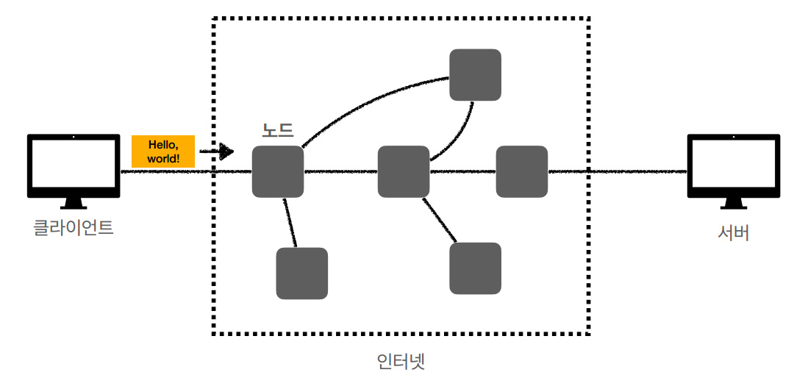
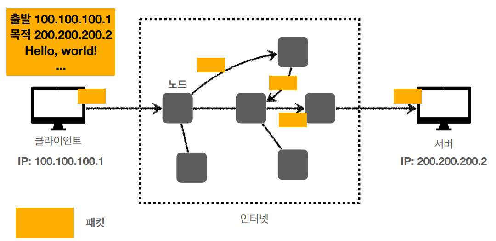
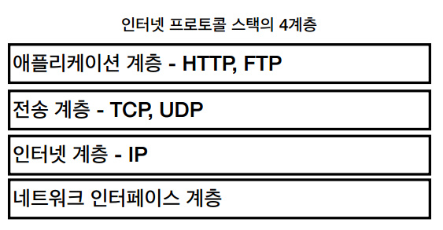
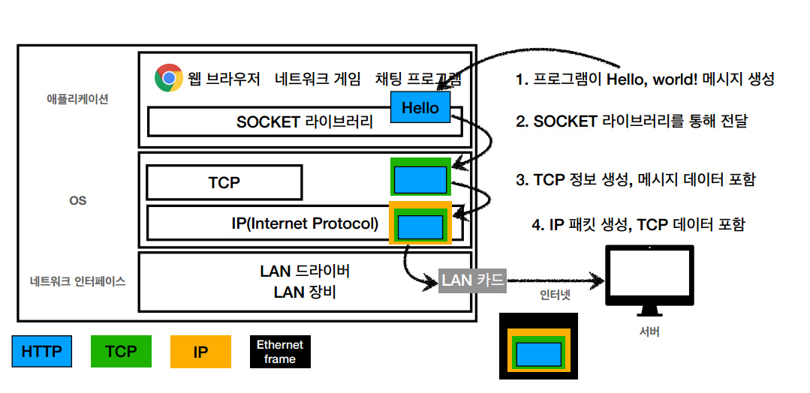
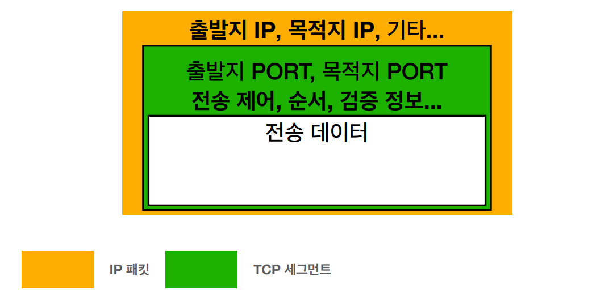

# HTTP

## 1. Internet-network

### 1-1. 인터넷 통신

* 클라이언트와 서버와의 통신은 복잡한 인터넷 망이 필요하다.
* 단순한 요청도 다양한 노드를 거쳐서 서버로 전송된다.

### 1-2. IP(Internet Protocol)

#### IP 인터넷 프로토콜 역할

* 지정된 IP 주소(IP Address)에 데이터 전달
* 패킷(Packet)이라는 통신 단위로 데이터 전달

#### IP 패킷 정보

* 출발지 IP
* 목적지 IP
* 기타...
* 전송 데이터

#### 클라이언트 패킷 전달

* 출발 IP Address를 가진 패킷이 목적 IP Address 까지 전송이 된다.
* 중간에는 노드간에 패킷을 전달하여 최종 목적지까지 도달한다.

#### 서버 패킷 전달

* 서버에서도 패킷을 전달할때 출발 IP Address 정보를 토대로 노드간에 패킷을 전달하여 클라이언트까지 도달한다.

#### IP 프로토콜의 한계

* 비연결성
    * 패킷을 받을 대상이 없거나 서비스 불능 상태여도 패킷 전송
* 비신뢰성
    * 중간에 패킷이 사라지면? - 패킷 소실
    * 패킷이 순서대로 안오면? - 패킷 전달 순서 문제 발생
* 프로그램 구분
    * 같은 IP를 사용하는 서버에서 통신하는 애플리케이션이 둘 이상이면?

### 1-3. TCP, UDP

#### 인터넷 프로토콜 스택의 4계층

#### 프로토콜 계층

#### IP 패킷 정보

* 패킷 : package + bucket
* 통신망을 통해 전송하기 쉽도록 자른 데이터의 전송 단위

#### TCP/IP 패킷 정보

* 기존의 IP 패킷에 추가로 출발지 port, 목적지 port, 전송제어 순서 검증 정보 추가
* IP 만으로는 해결하지 못했던 문제를 해결

#### TCP 특징

전송 제어 프로토콜(Transmission Control Protocol)

* 연결 지향 - TCP 3 wqy handshake (가상 연결)
* 데이터 전달 보증
* 순서 보장
* 신뢰할 수 있는 프로토콜
* 현재는 대부분 TCP 사용

#### TCP 3 way handshake

클라이언트 -> 서버로 SYN ACK 를 클라이언트 + SYN 클라이언트 -> 서버 ACK (동시에 데이터도 전송)
데이터 전송 상호간의 신뢰성 단 개념적으로만 연결되어 있음 (물리적 x)
중간의 노드 상태는 알수 없고 클라이언트와 서버만 논리적으로 연결이 되었다고 논리적으로 생각한다.

#### 데이터 전달 보증

데이터 전송 -> 데이터를 잘 받았다고 서버가 클라이언트로 다시 알려줌

#### 순서 보장

1, 2, 3 -> 1, 3, 2 -> 패킷 2번부터 다시 보내기를 요청 더 최적화 된 방법들이 존재하지만 우선 개념적으로 순서를 보장할 수 있다고는 것만 알고 가면 된다

#### UDP 특징

사용자가 하나의 PC 에서 여러개의 네트워크가 필요한 작업을 할때(게임을 하면서, 공략집을 확인)
port 가 각 애플리케이션에 맞도록 배분?? 사용자가 더욱 최적화 하겠다?? UDP 로... HTTP3 스팩에서는 더욱 최적화가 이루어지며 UDP 로도 신뢰할수 있는 정보 전달 가능???

