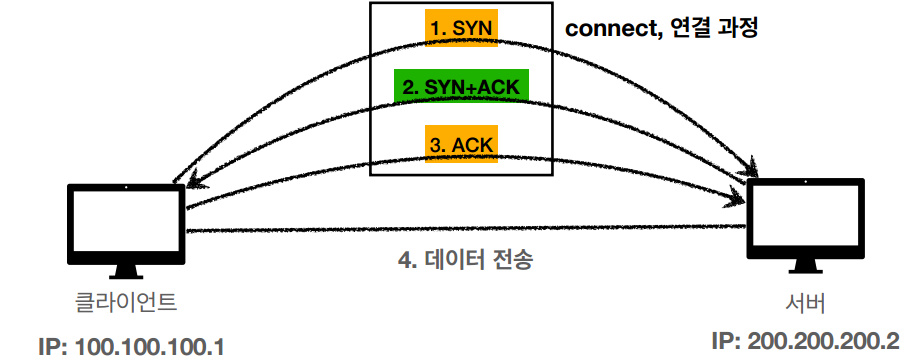
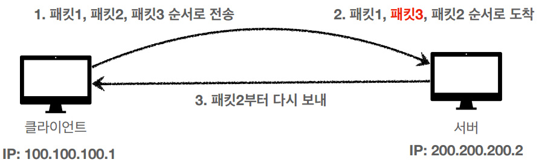

# HTTP

## 1. Internet-network

### 1-1. 인터넷 통신

* 클라이언트와 서버와의 통신은 복잡한 인터넷 망이 필요하다.
* 단순한 요청도 다양한 노드를 거쳐서 서버로 전송된다.

### 1-2. IP(Internet Protocol)

#### IP 인터넷 프로토콜 역할

* 지정된 IP 주소(IP Address)에 데이터 전달
* 패킷(Packet)이라는 통신 단위로 데이터 전달

#### IP 패킷 정보

* 출발지 IP
* 목적지 IP
* 기타...
* 전송 데이터

#### 클라이언트 패킷 전달

* 출발 IP Address를 가진 패킷이 목적 IP Address 까지 전송이 된다.
* 중간에는 노드간에 패킷을 전달하여 최종 목적지까지 도달한다.

#### 서버 패킷 전달

* 서버에서도 패킷을 전달할때 출발 IP Address 정보를 토대로 노드간에 패킷을 전달하여 클라이언트까지 도달한다.

#### IP 프로토콜의 한계

* 비연결성
    * 패킷을 받을 대상이 없거나 서비스 불능 상태여도 패킷 전송
* 비신뢰성
    * 중간에 패킷이 사라지면? - 패킷 소실
    * 패킷이 순서대로 안오면? - 패킷 전달 순서 문제 발생
* 프로그램 구분
    * 같은 IP를 사용하는 서버에서 통신하는 애플리케이션이 둘 이상이면?

### 1-3. TCP, UDP

#### 인터넷 프로토콜 스택의 4계층

#### 프로토콜 계층

#### IP 패킷 정보

* 패킷 : package + bucket
* 통신망을 통해 전송하기 쉽도록 자른 데이터의 전송 단위

#### TCP/IP 패킷 정보

* 기존의 IP 패킷에 추가로 출발지 port, 목적지 port, 전송제어 순서 검증 정보 추가
* IP 만으로는 해결하지 못했던 문제를 해결

#### TCP 특징

전송 제어 프로토콜(Transmission Control Protocol)

* 연결 지향 - TCP 3 wqy handshake (가상 연결)
* 데이터 전달 보증
* 순서 보장
* 신뢰할 수 있는 프로토콜
* 현재는 대부분 TCP 사용

#### TCP 3 way handshake

1. 클라이언트가 서버로 SYN(연결 요청)을 보낸다.
2. 서버가 클라이언트에게 연결요청을 받았다는 의미로 ACK 를 보냄과 동시에 SYN 을 보낸다.
3. 클라이언트가 서버에게 SYN에 대한 ACK 를 전송한다.
4. 데이터를 전송한다. (3번 단계에서 ACK와 함께 데이터 전송 가능)

* SYN(연결 요청)을 보내면 연결 요청에 승인한다는 ACK를 보내는 작업을 클라이언트와 서버가 모두 수행해야 클라이언트와 서버가 논리적으로 연결이 되었다고 말할 수 있다.

#### 데이터 전달 보증

* 클라이언트가 서버로 데이터를 전송하면 서버는 클라이언트에게 데이터를 잘 받았다고 알려준다.

#### 순서 보장

* 더 최적화된 방법도 존재한다.
* 우선 개념적으로 순서를 보장할 수 있다는 것만 알고 넘어가자.

#### UDP 특징

사용자 데이터그램 프로토콜(User Datagram Protocol)

* 하얀 도화지에 비유(기능이 거의 없음)
* 연결 지향 - TCP 3 way handshake X
* 데이터 전달 보증 X
* 순서 보장 X
* 데이터 전달 및 순서가 보장되지 않지만, 단순하고 빠름
* 정리
    * IP와 거의 같다. + PORT + 체크섬 정도만 추가
    * 애플리케이션에서 추가 작업 필요

