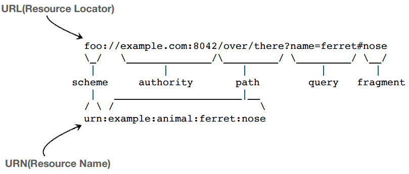
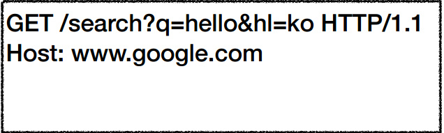
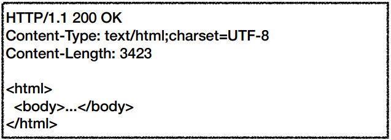

## 2. URI와 웹 브라우저 요청 흐름

* URL
* 웹 브라우저 요청 흐름

### 2-1. URI (Uniform Resource Identifier)

* URI? URL? URN?
* URI는 로케이터(locator), 이름(name) 또는 둘다 추가로 분류될 수 있다.

#### URI 단어 뜻

* **U**niform : 리소스 식별하는 통일된 방식
* **R**esource : 자원, URI로 식별할 수 있는 모든 것(제한 없음)
* **I**dentifier : 다른 항목과 구분하는데 필요한 정보

* URL : Uniform Resource Locator
* URN : Uniform Resource Name

#### URL, URN 단어 뜻

* URL - Locator : 리소스가 있는 위치를 지정
* URN - Name : 리소스에 이름을 부여
* 위치는 변할 수 있지만, 이름은 변하지 않는다.
* urn:isbn:8960777331 (어떤 책의 isbn URN)
* URN 이름만으로 실제 리소스를 찾을 수 있는 방법이 보편화 되지 않음
* **앞으로 URI를 URL과 같은 의미로 이야기하겠음**

#### URL 분석

<https://www.google.com/search?q=hello&hl=ko>

#### URL 전체 문법

* scheme://[userinfo@]host[:port][/path][?query][#fragment]
* https://www.google.com:443/search?q=hello&hl=ko
    

* 프로토콜(https)
* 호스트명(www.google.com)
* 포트 번호(443)
* 패스(/search)
* 쿼리 파라미터(q=hello&hl=ko)

#### URL scheme

* **scheme:**//[userinfo@]host[:port][/path][?query][#fragment]
* **https:**//www.google.com:443/search?q=hello&hl=ko
    
* 주로 프로토콜 사용
* 프로토콜 : 어떤 방식으로 자원에 접근할 것인가 하는 약속, 규칙
    * 예) http, https, ftp 등등
* http는 80 포트, https는 443 포트를 주로 사용, 포트는 생략 가능
* https는 http에 보안 추가 (HTTP Secure)

#### URL userinfo

* scheme://**[userinfo@]**host[:port][/path][?query][#fragment]
* https://www.google.com:443/search?q=hello&hl=ko   

* URL에 사용자 정보를 포함해서 인증
* 거의 사용하지 않음

#### URL host

* scheme://[userinfo@]**host**[:port][/path][?query][#fragment]
* https:// **www.google.com**:443/search?q=hello&hl=ko   
* 호스트명
* 도메인명 또는 IP 주소를 직접 사용가능

#### URL PORT

* scheme://[userinfo@]host **[:port]**[/path][?query][#fragment]
* https://www.google.com: **443**/search?q=hello&hl=ko  
* 포트(PORT)
* 접속 포트
* 일반적으로 생략, 생략시 http는 80, https는 443

#### URL path

* scheme://[userinfo@]host[:port] **[/path]**[?query][#fragment]
* https://www.google.com:443 **/search**?q=hello&hl=ko  
* 리소스 경로(path), 계층적 구조
* 예)
    * /home/file1.jpg
    * /members
    * /members/100,/items/iphone12

#### URL query

* scheme://[userinfo@]host[:port] **[/path]**[?query][#fragment]
* https://www.google.com:443/search **?q=hello&hl=ko**  
* key = value 형태
* ?로 시작, &로 추가 가능 ?keyA=valueA&keyB=valueB
* query parameter, query string 등으로 불림, 웹서버에 제공하는 파라미터, 문자형태

#### URL fragment

* scheme://[userinfo@]host[:port][/path][?query] **[#fragment]**
* http://docs.spring.io/spring-boot/docs/current/reference/html/getting-started.html/
  **#getting-started-introducing-spring-boot**   
* fragment
* html 내부 북마크 등에 사용
* 서버에 전송하는 정보 아님

### 2-2. 웹 브라우저 요청 흐름

* https://www.google.com/search?q=hello&hl=ko
* https://**www.google.com:443**/search?q=hello&hl=ko
    * DNS 조회
    * HTTPS PORT 생략, 443
    * HTTP 요청 메시지 생성

#### HTTP 요청 메시지

  

#### HTTP 메시지 전송

  

* TCP/IP 계층에서 생성된 패킷은 HTTP 메시지, 출발지 IP, PORT, 목적지 IP, PORT 를 포함하고 있다.
* 패킷이 웹 브라우저 (클라이언트) 에서 서버로 전송된다.
* 서버는 HTTP 응답 메시지를 웹 브라우저에게 전송한다.

  

* HTTP 응답메시지  
  

* 웹 브라우저는 응답 패킷을 받아서 HTML를 랜더링하여 사용자에게 페이지를 보여준다.